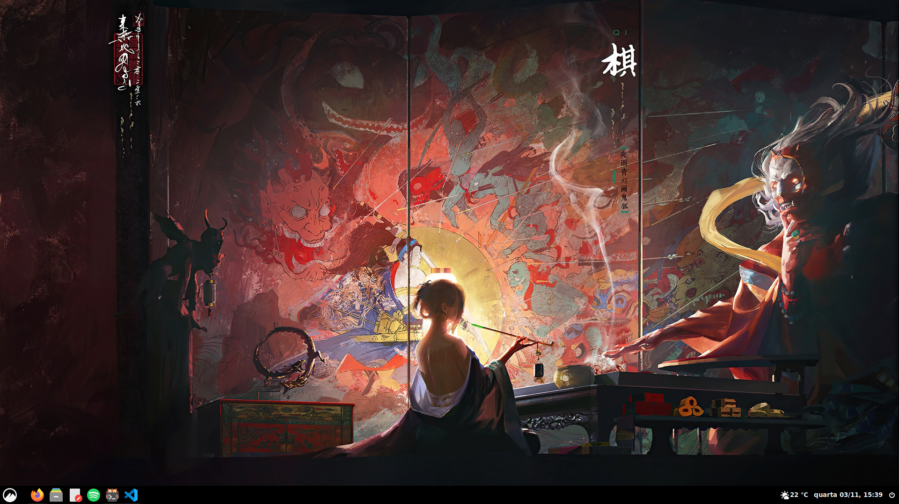
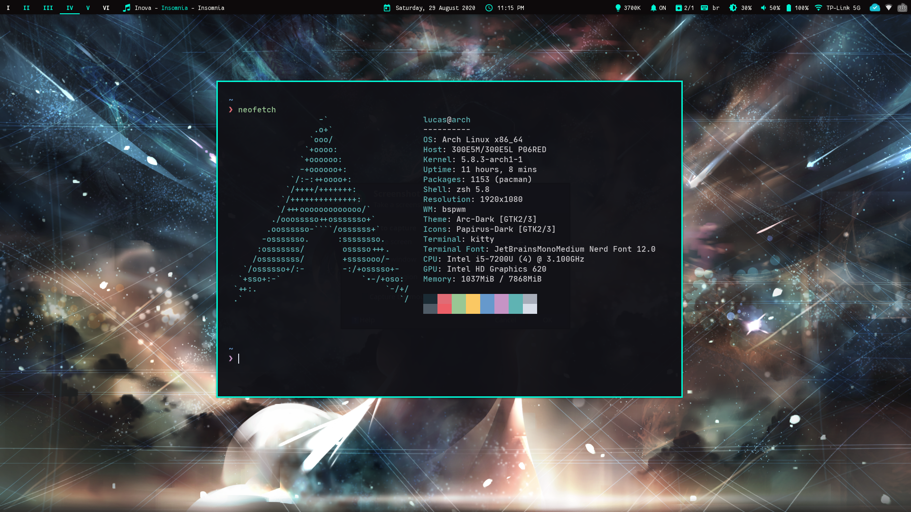

# Dotfiles
The configuration files for my Arch Linux.

## General Info
- **Distro**: Arch Linux
- **Desktop Environment**: Cinnamon
- **Window Manager**: bspwm
- **Web Browser**: Firefox
- **Terminal**: kitty
- **Terminal Editor**: Neovim
- **Graphical Editor**: VS Code
- **Monospace Font**: JetBrainsMono Medium
- **Serif Font**: Merriweather
- **Sans-serif Font**: DejaVu Sans
## Screenshots

### Current (cinnamon)

### Old (bspwm)

