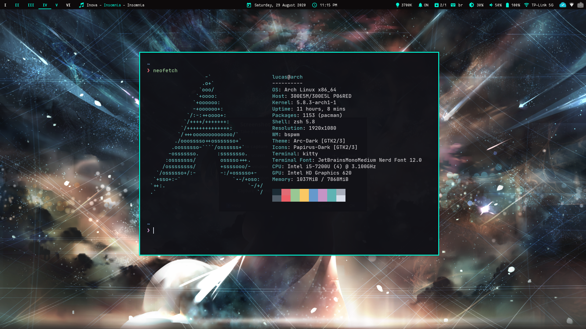

# Dotfiles.
My configuration for zsh, nvim, bspwm, sxhkd, polybar, and more.

## System Info
* **Distro**: Arch Linux
* **WM**: BSPWM
* **Status Bar**: Polybar
* **Terminal**: kitty
* **Editor**: Neovim and VS Code
* **Font**: JetBrainsMono Medium - From Nerd Fonts

## Screenshot

